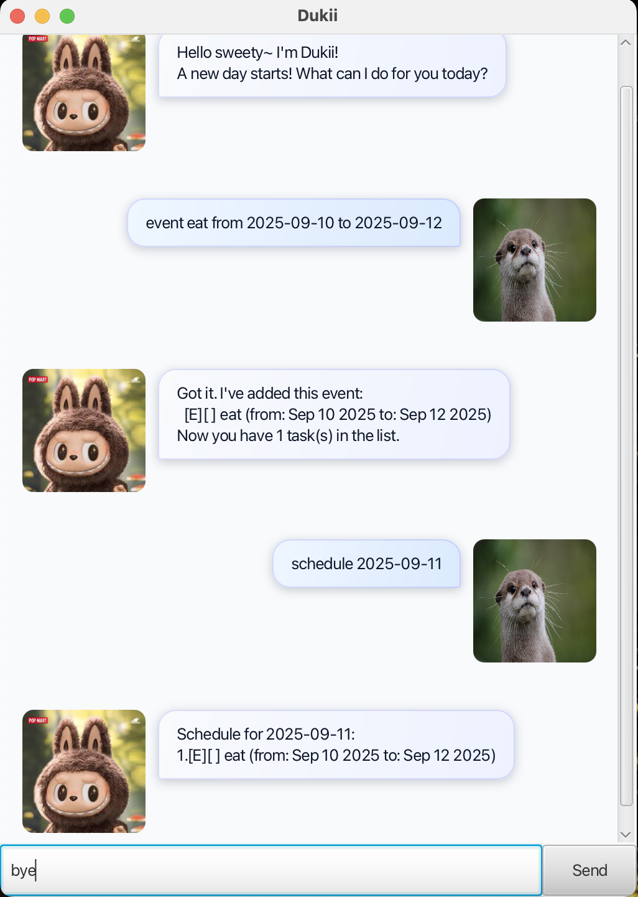

# Dukii

Keyboard-first task manager with a friendly GUI. Manage todos, deadlines, and events via simple commands. Dukii auto-saves your tasks and supports both GUI (JavaFX) and CLI modes.



## User Guide

For full instructions, command formats, examples, FAQs, and a command summary, see the User Guide:

- docs/User Guide: [docs/README.md](docs/README.md)

## Quick start

Prerequisites: Java 17 or later installed.

1. Clone this repository.
2. Build a fat JAR:
   - macOS/Linux:
     ```
     ./gradlew shadowJar
     ```
   - Windows:
     ```
     gradlew.bat shadowJar
     ```
3. Run Dukii (GUI):
   ```
   java -jar build/libs/dukii.jar
   ```
   Alternatively, run (CLI, developer mode):
   ```
   java -cp build/classes/java/main dukii.Dukii
   ```

Data is saved automatically to `./data/dukii.txt` relative to your working directory.

## Features (brief)

- Add todos, deadlines, and events
- List tasks; mark/unmark; delete
- Find tasks by keyword
- View schedule for a date (deadlines due that day, events spanning that day)
- Exit gracefully

See the full command formats and examples in the [User Guide](docs/README.md).

## Development

- Run tests:
  ```
  ./gradlew test
  ```
- Run in IDE:
  - GUI entry point: `dukii.Main`
  - CLI entry point: `dukii.Dukii`
- Artifact: `build/libs/dukii.jar`

