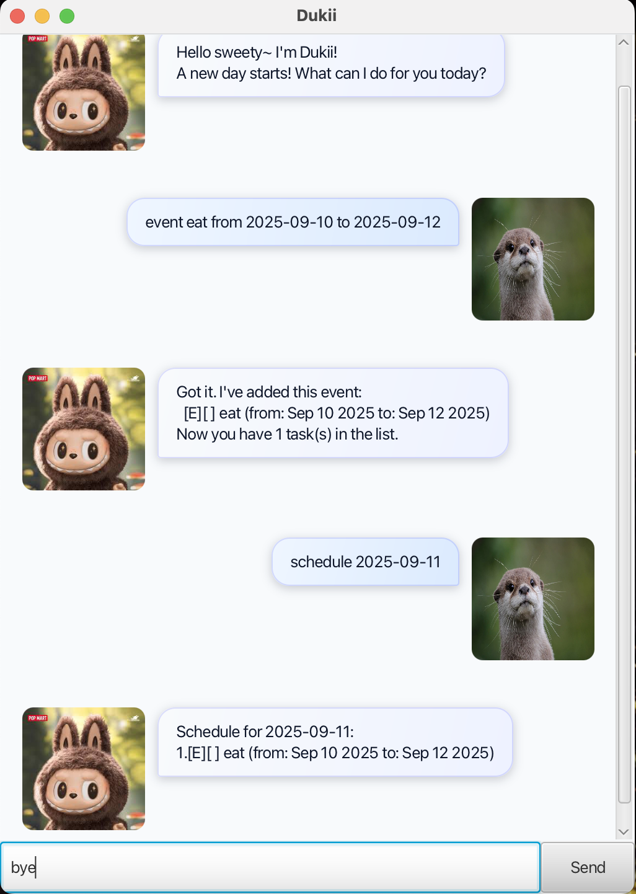

# Dukii User Guide

Keyboard-first task manager with a friendly GUI. Type commands to manage todos, deadlines, and events, search, view your daily schedule, and more. If you can type fast, Dukii gets things done faster than traditional point-and-click apps.



## Quick start

1. Ensure you have Java 17 or above installed on your computer.
   - macOS users: Use an exact JDK 17 installation for best compatibility.
2. Build the app (or download the provided JAR).
   - Using Gradle: `./gradlew shadowJar`
   - The fat JAR will be at `build/libs/dukii.jar`.
3. Run the application:
   - GUI: `java -jar build/libs/dukii.jar`
   - CLI (developers): run the `dukii.Dukii` main class from your IDE or `java -cp build/classes/java/main dukii.Dukii`
4. A window like the screenshot above will appear. Type commands in the input box and press Enter.
5. Try these commands:
   - `list` — Lists all tasks.
   - `todo read book` — Adds a todo.
   - `deadline submit report by 2025-09-30` — Adds a deadline with due date.
   - `event project sprint from 2025-10-01 to 2025-10-14` — Adds a multi-day event.
   - `bye` — Exits the app.

## Notes about the command format

- Words in UPPER_CASE are parameters supplied by you, e.g., in `todo DESCRIPTION`, `DESCRIPTION` is user input.
- Dates must use ISO format `yyyy-MM-dd`, e.g., `2025-09-30`.
- Indexes refer to the numbers shown by `list` and start from 1.
- Commands requiring parameters must match the format exactly (no extra text).
- Dukii auto-saves after commands that change data; no manual save is needed.

## Features

### Listing all tasks: `list`
Shows all tasks in the list.

- **Format**: `list`
- If there are no tasks, Dukii replies cheerfully that your list is empty.

Examples:

```
list
```

Expected output (when empty):

```
No task there! Enjoy your day sweety~
```

---

### Adding a todo: `todo`
Adds a todo (no date/time).

- **Format**: `todo DESCRIPTION`

Examples:

```
todo read book
```

---

### Adding a deadline: `deadline`
Adds a task due on a specific date.

- **Format**: `deadline DESCRIPTION by DATE`
- **DATE** must be `yyyy-MM-dd`.

Examples:

```
deadline submit report by 2025-09-30
```

---

### Adding an event: `event`
Adds a task spanning a start date to an end date.

- **Format**: `event DESCRIPTION from FROM_DATE to TO_DATE`
- Both dates must be `yyyy-MM-dd`.

Examples:

```
event project sprint from 2025-10-01 to 2025-10-14
```

---

### Marking a task as done: `mark`
Marks the specified task as completed.

- **Format**: `mark INDEX`
- `INDEX` must be a positive integer within the shown list range.

Examples:

```
mark 2
```

---

### Marking a task as not done: `unmark`
Reverts a previously completed task back to pending.

- **Format**: `unmark INDEX`

Examples:

```
unmark 2
```

---

### Deleting a task: `delete`
Deletes the specified task permanently.

- **Format**: `delete INDEX`

Examples:

```
delete 3
```

---

### Finding tasks by keyword: `find`
Finds tasks whose descriptions contain the given keyword (case-insensitive substring match).

- **Format**: `find KEYWORD`

Examples:

```
find book
```

---

### Viewing tasks on a date: `schedule`
Shows deadlines due on that date and events occurring on that date (inclusive).

- **Format**: `schedule DATE`
- **DATE** must be `yyyy-MM-dd`.

Examples:

```
schedule 2025-10-02
```

---

### Exiting the program: `bye`
Closes the application.

- **Format**: `bye`

## FAQ

- How do I run the GUI vs CLI?
  - GUI: `java -jar build/libs/dukii.jar`.
  - CLI (developers): run `dukii.Dukii` from your IDE or via `java -cp build/classes/java/main dukii.Dukii`.
- Where is my data saved?
  - At `./data/dukii.txt` relative to your working directory.
- What date format should I use?
  - Always `yyyy-MM-dd`, e.g., `2025-09-30`.
- I moved the JAR to another folder and my tasks disappeared.
  - Data is saved relative to the working directory. Ensure you run Dukii from the same folder as before, or copy the `data/dukii.txt` file over.


## Command summary

| Action     | Format, Examples |
| ---------- | ---------------- |
| **List**   | `list` |
| **Todo**   | `todo DESCRIPTION` e.g., `todo read book` |
| **Deadline** | `deadline DESCRIPTION by DATE` e.g., `deadline submit report by 2025-09-30` |
| **Event**  | `event DESCRIPTION from FROM_DATE to TO_DATE` e.g., `event sprint from 2025-10-01 to 2025-10-14` |
| **Mark**   | `mark INDEX` e.g., `mark 1` |
| **Unmark** | `unmark INDEX` e.g., `unmark 1` |
| **Delete** | `delete INDEX` e.g., `delete 3` |
| **Find**   | `find KEYWORD` e.g., `find book` |
| **Schedule** | `schedule DATE` e.g., `schedule 2025-10-02` |
| **Exit**   | `bye` |

---